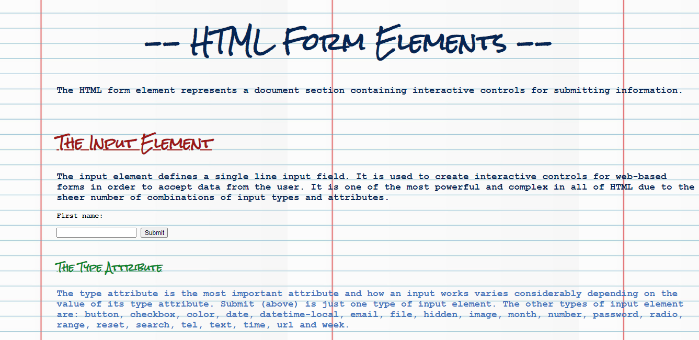

# HTML Form Elements

###### April 2020

_I made this page as I was learning about HTML form elements and I wanted to try some of them out. I enjoy putting into practice what I am learning and find that it is a good way of helping me to remember things. It has proved a useful learning tool as I have come back to this page a few times to refresh myself on the subject. I also really enjoyed styling this page and making it look like a notebook!_

## Built with:

- HTML
- CSS

## Getting Started:

Clone the repo as instructed below

## Prerequisites:

No prerequisites

## Installation

1.  Clone the repo

`git clone https://github.com/katiehawcutt/html-form-elements.git`

2. Run the index.html in a browser

## Usage

View the webpage! The form data is not saved anywhere. It was purely an exercise in how to implement different types of HTML form elements.
